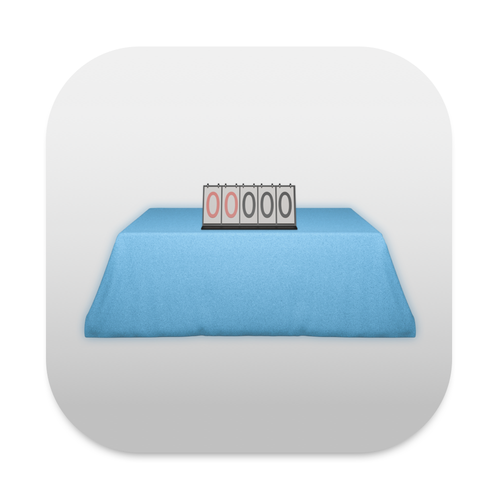

<h1 align="center">DTB Kampfrichtereinsatzpläne</h1>

<p align="center">
  
</p>

<p align="center">
  A native desktop app for building <em>Kampfrichtereinsatzpläne</em> (judge deployment plans)
  for German gymnastics-wheel (Rhönrad) and Cyr-wheel competitions run under the
  <strong>Deutscher Turner-Bund</strong>.
</p>

<p align="center">
  <a href="https://codeberg.org/philippremy/DTB-Kampfrichtereinsatzplaene/releases">Releases</a> ·
  <a href="https://codeberg.org/philippremy/DTB-Kampfrichtereinsatzplaene/releases/tag/tip">Nightly (Tip)</a> ·
  <a href="LICENSE">AGPL-3.0-or-later</a>
</p>

---

## Overview

A plan assigns named judges to roles — head (OK), difficulty (SK), execution (AK), artistic
impression (AIK) — across the judging tables of a competition, split between a **qualification**
and a **finale** round. The app manages a list of competitions, edits each one with debounced
autosave, detects double-booked judges, and exports the finished plan as **PDF** or **Word
(.docx)**.

The interface is German. It follows the operating system's light/dark appearance and adopts a
platform-appropriate look on each OS (macOS liquid glass, Windows Mica/Acrylic, Linux
client-side decorations). All data is stored locally under
`de.philippremy.DTB-Kampfrichtereinsatzpläne` in the OS application-data directory — nothing is
sent anywhere except an opt-in crash/feedback report and the update check.

## Features

- **Competition editor** — organisation (DTB, IRV, all 20 Landesturnverbände), date, location,
  unified or split meeting times, responsible persons.
- **Judging tables** per phase — Rhönrad (Geradeturnen, Geradeturnen auf Musik, Spiralen, Sprung)
  and Cyr-Wheel (technisch / künstlerisch); drag to reorder; change discipline in place.
- **Reserve judges** and a **rich-text remarks** field (bold / italic / underline / colour).
- **Conflict detection** — a judge booked in two positions within a phase is flagged inline.
- **Export** — PDF (via an embedded Typst engine, optional PDF/A & PDF/UA standards), DOCX (real
  Word styles, embedded fonts, a repeating header with the org emblem), and a `.dtbke` backup
  blob for the whole database.
- **Live preview** window and a **unified save dialog** (native panel on macOS/Windows).
- **Undo/redo** (document-level history), **settings** (theme, autosave interval, reduced
  motion/transparency, log level, custom keybindings), and a **log viewer**.
- **In-app updater** with a **Stable** and a **Tip/Nightly** channel.
- **Out-of-process crash reporter** (standard minidump) and in-app bug/feature-request forms.

## Download

| Channel | What | Link |
|---|---|---|
| **Stable** | Tagged releases (`vX.Y.Z`) + first-install artifacts (`.dmg` / `.msi` / `.deb` / `.rpm` / `.AppImage`) | [releases](https://codeberg.org/philippremy/DTB-Kampfrichtereinsatzplaene/releases) |
| **Tip / Nightly** | Rolling build of every push to `main` | [`tip` release](https://codeberg.org/philippremy/DTB-Kampfrichtereinsatzplaene/releases/tag/tip) |

Once installed, the app updates itself (choose the channel in **Einstellungen → Aktualisierung**).
On **Linux** the updater only opens the download page — replace the package manually.

- **macOS** builds are ad-hoc signed unless a release is cut with a Developer-ID identity, so the
  first launch after download or after a self-update shows a Gatekeeper prompt (right-click →
  *Open* once).
- **Windows** builds are statically linked (no Visual C++ redistributable needed).

> Development and testing happen primarily on macOS; the Windows and Linux builds are newer and
> less exercised.

## System requirements

> These are the **actual technical floors**, derived from the graphics APIs and toolchain the
> app is built against — not a marketing minimum.

| Platform | Minimum OS | CPU | GPU |
|---|---|---|---|
| **macOS (Apple Silicon)** | macOS **11.0 Big Sur** | any M-series | — |
| **macOS (Intel)** | macOS **10.15 Catalina** (technical); the shipped bundle currently declares **11.0** — see below | **x86-64-v3** — a Mac with a Haswell CPU or newer (mid-2013+) | Metal-capable (any Mac that runs Catalina) |
| **Windows** | **Windows 10, version 1803** (build 17134, "April 2018 Update"), 64-bit | x64: x86-64-v3 (Haswell 2013+ / Excavator 2015+). ARM64: any | Direct3D 11, feature level 10.1+ |
| **Linux** | no fixed version — **glibc ≥ the build host's** (see below) | x86-64-v3 (x86_64) / any (aarch64) | Vulkan 1.1+ driver (or an OpenGL 3.3 fallback; llvmpipe works but is slow) |

### macOS

- **Pre-Ventura is fully supported.** Big Sur (11) and Monterey (12) run without issue.
- **The Intel technical floor is macOS 10.15 Catalina.** gpui compiles its Metal shaders at
  runtime (`gpui-base` enables the `runtime_shaders` feature) and, at renderer initialisation,
  calls **`MTLDevice.supportsFamily:`** with **`MTLGPUFamily`** — both introduced in **macOS
  10.15 / iOS 13**. macOS 10.14 Mojave and earlier fail there. gpui's own source also states it
  targets 10.15, and every AppKit API the app uses (`NSVisualEffectView`, `NSStackView`,
  `NSLayoutAnchor`, `NSSavePanel` sheets, window-button repositioning) predates Big Sur —
  anything newer is guarded with a runtime `isOperatingSystemAtLeastVersion` check.
- **Pre-Catalina (Mojave 10.14 and earlier) is not supported.**
- **CPU**: because the Intel build is `x86-64-v3`, the practical floor is a **2013-or-newer Mac**
  (Haswell — AVX2/BMI2/FMA). A 2012 Mac can run Catalina but lacks AVX2 and would crash with an
  illegal instruction.
- **Apple Silicon is 11.0** only because that is the oldest macOS that runs on M-series hardware
  at all — there is no software reason it could not be lower.
- **As shipped**, `Info.plist`'s `LSMinimumSystemVersion` is `11.0`
  (`dtb-ke-bundle::meta::MACOS_MIN_VERSION`), so Gatekeeper refuses to launch the bundle on
  10.15 even though the code would run. Lower that constant (and rebuild) to support Catalina on
  Intel — it is untested there.
- The bundle's recorded SDK version is restamped to macOS 26 with `vtool` at package time so the
  redesigned "Tahoe" window controls appear regardless of the build host's SDK; this does not
  affect the deployment target and does not gate launch on older systems.

### Windows

- **Windows 7, 8 and 8.1 are not supported**, and neither is Windows 10 before version 1803.
  Two independent reasons:
  1. gpui's Direct3D 11 renderer creates an **`IDXGIFactory6`** (`CreateDXGIFactory2`), which
     requires the DXGI 1.6 runtime — **Windows 10, version 1803**. It also needs
     **`IDWriteFactory5`** (DirectWrite, Windows 10 build 15063) and DirectComposition. These
     are hard failures at startup on anything older.
  2. Since **Rust 1.78** (May 2024) the `*-pc-windows-*` targets — including the `*-gnullvm`
     ones this project ships — require **Windows 10** for both the compiler and the binaries it
     produces. Windows 7/8/8.1 are Tier-3-only via separate `*-win7-windows-*` targets, which
     gpui does not support.
- **CPU**: the x64 build sets `target-cpu=x86-64-v3` in `.cargo/config.toml` — it needs AVX2,
  BMI2, FMA (Intel Haswell / 4th-gen Core, 2013+; AMD Excavator 2015+ / Zen). The **ARM64**
  build has no such constraint.
- **GPU**: any card supporting Direct3D feature level 10.1 (roughly 2008+). Release shaders are
  precompiled to Shader Model 4.1 bytecode, so no `d3dcompiler` DLL is needed at runtime.
- Mica translucency needs Windows 11 22H2 (build 22621); older Windows 10/11 step down to an
  Acrylic blur (1809+) and then to an opaque window — automatic, never fatal.

### Linux

- **There is no meaningful minimum OS version**, but the release/Tip binaries are dynamically
  linked against the CI builder's **glibc**, and that builder runs a **rolling-release
  distribution (CachyOS)** — so the downloads track a current-year glibc (2.4x) and will *not*
  start on the enterprise/LTS distributions frozen below it (Debian 12, Ubuntu 22.04/24.04 LTS,
  RHEL 9, …). On Linux, **building from source against your own distribution is the reliable
  path.**
- Needs an X11 or Wayland session, system **fontconfig**, **xkbcommon**, and a **Vulkan** loader
  (`libvulkan.so.1`) with a working ICD; wgpu falls back to OpenGL 3.3 and then to software
  rendering (`lavapipe`/`llvmpipe`, functional but slow).
- x86_64 builds require an x86-64-v3 CPU (as on Windows); aarch64 builds do not.
- The in-app updater does not self-install on Linux; it opens the release page instead.

## Building from source

### Prerequisites (all platforms)

- **Rust nightly** — the workspace uses the unstable `cfg_select!` macro, edition 2024 and Cargo
  resolver 3. A recent nightly is required; there is no pinned `rust-toolchain.toml`.
  ```sh
  rustup toolchain install nightly && rustup default nightly
  ```
- **Git** — several dependencies (`gpui`, `gpui-base`) are git checkouts; the first build fetches
  and compiles a large tree (gpui, aws-lc, turso, font-kit, the Typst compiler, …). Expect a
  long first build and a few GB of `target/`.
- A **C/C++ compiler** and **CMake** — `aws-lc-sys` / `ring` (TLS for the updater and the
  crash-report mail transport) build native code. On Windows x86, **NASM** as well.
- There is **no tokio** in the tree and it must stay that way — `lettre`, `self_update` and
  `turso` are deliberately pinned to `rustls` / `ureq` / executor-agnostic futures.

### Platform build tools

| OS | Also needs |
|---|---|
| **macOS** | Xcode **Command Line Tools** — the linker, `clang` for the native crypto crates (`aws-lc-sys` / `ring`), and `codesign` / `lipo` / `vtool` / `iconutil` for packaging. (Metal shaders are compiled at runtime, so no `metal` / `metallib` step.) |
| **Windows** | For a **release** build, gpui compiles HLSL shaders with **`fxc.exe`** from the Windows SDK (set `GPUI_FXC_PATH` or install the SDK). Debug builds compile shaders at runtime instead. The project ships with the `*-pc-windows-gnullvm` (llvm-mingw) toolchain; a local `*-pc-windows-msvc` dev build also works. |
| **Linux** | `pkg-config` plus development headers for **fontconfig**, **xkbcommon**, and your session's X11/Wayland client libraries. Debian/Ubuntu: `build-essential cmake pkg-config libfontconfig-1-dev libxkbcommon-dev libwayland-dev libxcb1-dev`. Arch: `base-devel cmake fontconfig libxkbcommon wayland libxcb`. |

### Clone & run

```sh
git clone https://codeberg.org/philippremy/DTB-Kampfrichtereinsatzplaene.git
cd DTB-Kampfrichtereinsatzplaene

# Run the GUI (debug; out-of-process crash capture is DISABLED here)
cargo run -p dtb-ke-ui

# Build the app with the crash helper staged (what you want for a real build)
cargo dtb-ke-bundle build            # add --release for an optimised build

# Build + package for the host OS (.app / portable folder + .msi / .deb / .rpm / .AppImage / tar)
cargo dtb-ke-bundle bundle --release
cargo dtb-ke-bundle bundle --release --formats dmg          # pick specific formats
```

`cargo dtb-ke-bundle` is a workspace alias (`.cargo/config.toml`) for the `dtb-ke-bundle`
packaging crate. Other useful commands:

```sh
cargo check --workspace                     # fast feedback
cargo test -p dtb-ke-persist                # backend round-trip
cargo test -p dtb-ke-export                 # Typst compile → PDF + preview
cargo test -p dtb-ke-ui                     # theme / keymap / model tests
cargo clippy --workspace
DTB_KE_SKIN=win  cargo run -p dtb-ke-ui     # preview another platform's skin
DTB_KE_GALLERY=1 cargo run -p dtb-ke-ui     # component gallery
```

> The workspace cannot cross-compile `dtb-ke-ui` between OS families (each backend needs its
> native shader compiler and system libraries). Cross-architecture builds *within* an OS work —
> see [`RUNNERS.md`](RUNNERS.md) for the CI build matrix.

## Repository layout

```
crates/
  dtb-ke-ui        the gpui application (the only binary) + app-state and editor model
  dtb-ke-types     serde data model (the persisted DTOs)
  dtb-ke-persist   async persistence over turso (SQLite-compatible)
  dtb-ke-export    Typst-backed PDF export + an independent DOCX exporter
  dtb-ke-resource  compile-time-embedded fonts, logos, org emblems
  dtb-ke-log       the logging sink
  dtb-ke-crash     out-of-process crash capture (library + minidump helper + offline symbolizer)
  dtb-ke-util      small shared utilities
  dtb-ke-bundle    build orchestration + platform packaging + release helpers
```

- [`RUNNERS.md`](RUNNERS.md) — the self-hosted CI runner architecture and the release workflow.
- [`UPDATER.md`](UPDATER.md) — the update manifest schema, channels, and signing.
- [`crates/dtb-ke-bundle/README.md`](crates/dtb-ke-bundle/README.md) — the packaging tool's
  commands and per-platform output.

## License

GNU Affero General Public License v3.0 or later — see [`LICENSE`](LICENSE).

© 2026 Philipp Remy.
